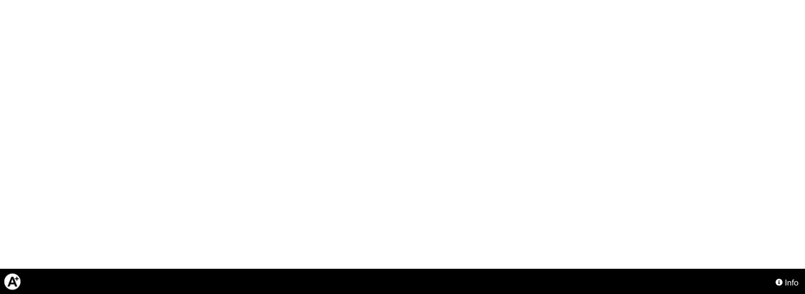
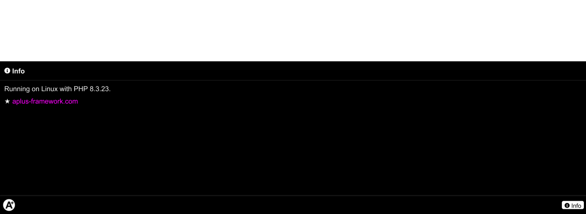
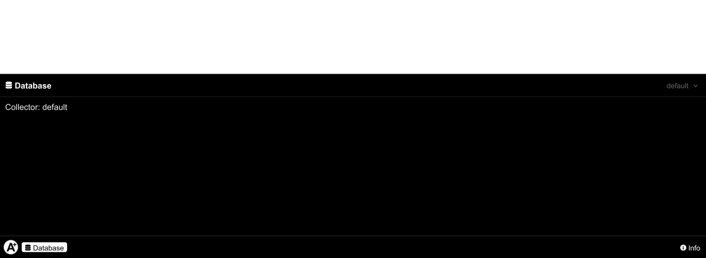
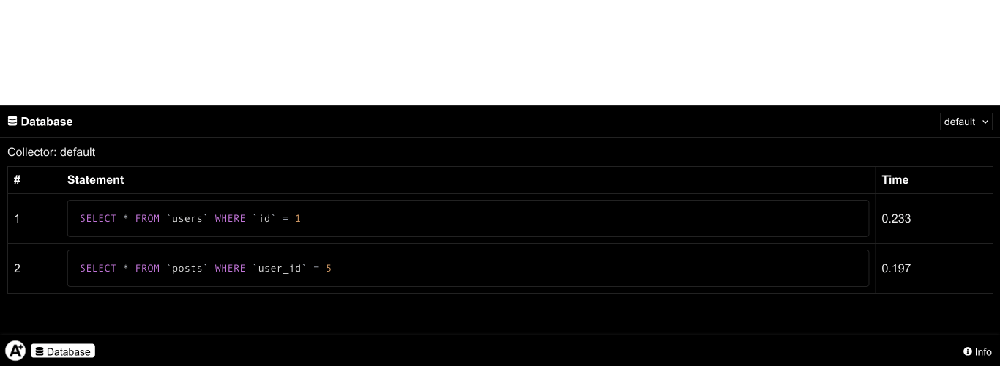
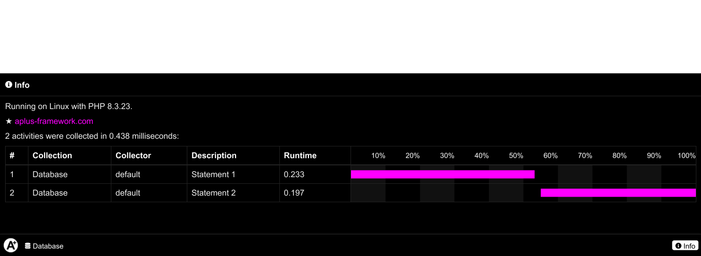
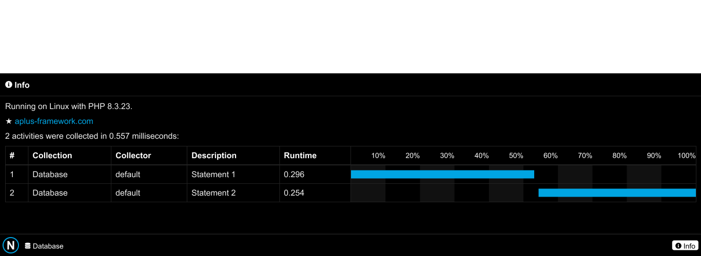
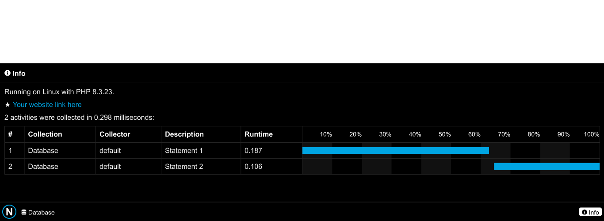
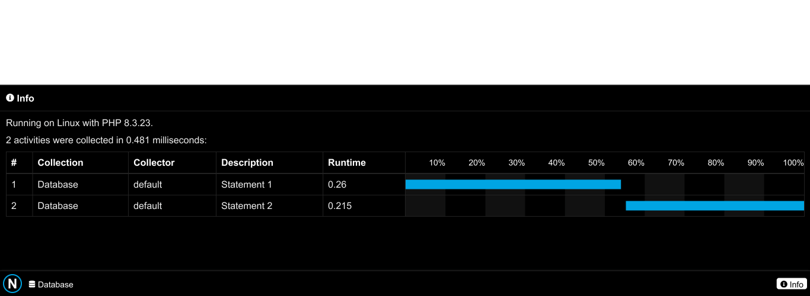

Debug
=====

.. image:: image.png
    :alt: Aplus Framework Debug Library

Aplus Framework Debug Library.

- `Installation`_
- `Exception Handler`_
- `Debugger`_
- `Conclusion`_

Installation
------------

The installation of this library can be done with Composer:

.. code-block::

    composer require aplus/debug

Exception Handler
-----------------

The ExceptionHandler class acts by catching exceptions and shows a screen
according to the environment, production or development.

Optionally, it can receive an instance of a logger to save messages from
exceptions.

In the example below, we see a basic configuration to initialize by setting the
object as an exception handler in a production environment:

.. code-block:: php

    use Framework\Debug\ExceptionHandler;
    use Framework\Log\Loggers\SysLogger;
    
    $logger = new SysLogger();
    
    $exceptionHandler = new ExceptionHandler(
        ExceptionHandler::PRODUCTION,
        $logger
    );
    $exceptionHandler->initialize();

In the ``initialize`` method it is possible to pass a argument to also set the
object as the error handler, which is the default. If you don't want to set it
as an error handler, pass the first argument to false:

.. code-block:: php

    $exceptionHandler->initialize(false);

Production Environment
######################

When the environment is production, a simple screen will appear informing that
something went wrong and, if the logger is set, the log id will appear:

.. code-block:: php

    use Framework\Database\Database; 
    
    $database = new Database('root', 'lupalupa', logger: $logger);

.. image:: img/exception-production.png
    :alt: Aplus Debug - Exception Handler in Production

It is possible to customize this screen by setting a view file using the
``setProductionView`` method. See the original files inside the
**src/Views/exceptions** directory.

Show Log Id
^^^^^^^^^^^

By default, the log id is shown in the production view.

If for some reason you don't want the log id to be shown, disable it as per the
example below:

.. code-block:: php

    $exceptionHandler->setShowLogId(false);

Development Environment
#######################

When the ExceptionHandler environment is set to development, a screen is shown
with much more details about the exception; the message, file location and line
number, trace, server input information, and the latest log.

.. code-block:: php

    $exceptionHandler = new ExceptionHandler(
        ExceptionHandler::DEVELOPMENT,
        $logger
    );

Example:

.. image:: img/exception-development.png
    :alt: Aplus Debug - Exception Handler in Development

The development view can also be customized. Set the file path via the
``setDevelopmentView`` method.

Hidden Inputs
^^^^^^^^^^^^^

All input global variables (``$_COOKIE``, ``$_ENV``, ``$_FILES``, ``$_GET``,
``$_POST`` and ``$_SERVER``) are shown on the exception page under development.

If you want to hide any of them, do so as per the following example:

.. code-block:: php

    $exceptionHandler->setHiddenInputs('$_ENV', '$_POST');

Search Engine
^^^^^^^^^^^^^

On the development page there is a link to search for the exception in a search
engine.

You can choose between several predefined engines:

- `ask <https://www.ask.com/web?q=aplus+framework>`_
- `baidu <https://www.baidu.com/s?wd=aplus+framework>`_
- `bing <https://www.bing.com/search?q=aplus+framework>`_
- `duckduckgo <https://duckduckgo.com/?q=aplus+framework>`_
- `google <https://www.google.com/search?q=aplus+framework>`_
- `yahoo <https://search.yahoo.com/search?p=aplus+framework>`_
- `yandex <https://yandex.com/search/?text=aplus+framework>`_

The default engine is ``google``.

If you want to change to another engine, do as in the example below:

.. code-block:: php

    $exceptionHandler->getSearchEngines()->setCurrent('bing');

Command Line
############

When the exception is thrown on the command line, it will be shown as in the
example below:

.. image:: img/exception-cli.png
    :alt: Aplus Debug - Exception Handler in CLI

Language
########

ExceptionHandler texts can be customized, using an instance of the Language
class, which can be passed by the constructor or the setter:

.. code-block:: php

    use Framework\Language\Language;

    $language = new Language('es');
    $exceptionHandler->setLanguage($language);

Example of the exception page in production with the Spanish language:

.. image:: img/exception-production-es.png
    :alt: Aplus Debug - Exception Handler in Production with Spanish language

JSON Responses
##############

If the server variable ``$_SERVER['HTTP_ACCEPT']`` contains ``application/json``
or the variable ``$_SERVER['HTTP_CONTENT_TYPE']`` starts with ``application/json``
the exception response page will be a page with JSON.

Below is an example of what the body of the responses will look like:

JSON in Production
^^^^^^^^^^^^^^^^^^

The production page is very simple. Remember that the log id can be disabled:

.. code-block:: json

    {
      "status": {
        "code": 500,
        "reason": "Internal Server Error"
      },
      "data": {
        "message": "Something went wrong. Please, back later.",
        "log_id": "632617344ccd"
      }
    }

JSON in Development
^^^^^^^^^^^^^^^^^^^

The development page contains detailed information about the exception:

.. code-block:: json

    {
      "status": {
        "code": 500,
        "reason": "Internal Server Error"
      },
      "data": {
        "exception": "mysqli_sql_exception",
        "message": "Access denied for user 'root'@'localhost'",
        "file": "/var/www/app/vendor/aplus/database/src/Database.php",
        "line": 230,
        "trace": [
          {
            "file": "/var/www/app/vendor/aplus/database/src/Database.php",
            "line": 230,
            "function": "real_connect",
            "class": "mysqli",
            "type": "->"
          },
          {
            "file": "/var/www/app/vendor/aplus/database/src/Database.php",
            "line": 103,
            "function": "connect",
            "class": "Framework\\Database\\Database",
            "type": "->"
          },
          {
            "file": "/var/www/app/public/index.php",
            "line": 19,
            "function": "__construct",
            "class": "Framework\\Database\\Database",
            "type": "->"
          }
        ],
        "log_id": "01884d106dd9"
      }
    }

JSON Flags
^^^^^^^^^^

The default flags for encoding JSON data are:

.. code-block:: php

    $flags = JSON_THROW_ON_ERROR | JSON_UNESCAPED_SLASHES | JSON_UNESCAPED_UNICODE;

You can customize them as per the following example:

.. code-block:: php

    $flags = JSON_THROW_ON_ERROR | JSON_PRETTY_PRINT;
    $exceptionHandler->setJsonFlags($flags);

Debugger
--------

The ``Framework\Debug\Debugger`` class has methods to help debug and, mainly,
render the debugbar.

.. code-block:: php

    <?php
    require __DIR__ . '/../vendor/autoload.php';

    use Framework\Debug\Debugger;

    $debugger = new Debugger();

    echo $debugger->renderDebugbar();

The first time you render the debug bar it will be collapsed to the bottom left
of the page:

When you click on the debug bar image, it will extend to the right of the page,
showing the "info" button:

When you click on the info button, the panel will open and you will be able to
see some debug information:

Collections
###########

Collections with information collected from various services can be added to the
debug bar.

See below how to create a collection:

.. code-block:: php

    use Framework\Debug\Collection;

    ...

    class DatabaseCollection extends Collection
    {
    }

    $collection = new DatabaseCollection('Database');
    $debugger->addCollection($collection);

The "Database" collection is created and added to the Debugger.

Collection Icon
^^^^^^^^^^^^^^^

All collections can have an icon. Its path can be defined as in the example
below:

.. code-block:: php

    class DatabaseCollection extends Collection
    {
        protected string $iconPath = __DIR__ . '/database.svg';
    }

Icons downloaded from `Font Awesome <https://fontawesome.com/v5/download>`_ are
used in the Aplus Framework libraries.

You can choose any icon you want from an SVG image. Copy and paste it into your
project.

To make the icon color change according to the text color, open the SVG file and
look for the ``path`` tag. In it, add the attribute ``fill="currentColor"`` as
shown in the example below and save the image.

.. code-block:: svg

    <svg ...>...<path fill="currentColor" d="..."/></svg>

Next you will see the collection icon in action.

Collectors
##########

Every collection must have debug data collectors, which should be displayed in
the panel content.

See below how to add a collector to the collection:

.. code-block:: php

    use Framework\Debug\Collector;

    ...

    class DatabaseCollector extends Collector
    {
        public function getContents() : string
        {
            return 'Collector: ' . $this->getName();
        }
    }

    $defaultCollector = new DatabaseCollector();
    $collection->addCollector($defaultCollector);

Once done, the collection will appear in the debugbar with its icon and name:

After clicking the collection button, a panel will open showing its contents:

You can add as many collectors as you want.

The example below shows how to add another collector. Think of it as another
instance connecting to a different database:

.. code-block:: php

    ...

    $otherCollector = new DatabaseCollector('other');
    $collection->addCollector($otherCollector);

Note that in the upper right part of the panel, a selection menu will appear in
which you can change the collector that is shown in the panel contents:

Collector Activities
^^^^^^^^^^^^^^^^^^^^

Every collector can collect activity data that can be displayed in the content
panel, the information panel, or both.

See below how to return activities that will be merged between all debugger
collectors and will appear in the info panel:

.. code-block:: php

    <?php
    ...

    class DatabaseCollector extends Collector
    {
        public function getActivities() : array
        {
            $activities = [];
            foreach ($this->getData() as $index => $data) {
                $activities[] = [
                    'collector' => $this->getName(),
                    'class' => static::class,
                    'description' => 'Statement ' . ($index + 1),
                    'start' => $data['start'],
                    'end' => $data['end'],
                    'statement' => $data['statement'],
                ];
            }
            return $activities;
        }
    }

Collector Contents
^^^^^^^^^^^^^^^^^^

So far, we've seen a very simple panel, showing only the collector's name.

In the example below, we will update the ``getContents`` method to return only
the collector name if there are no activities and a table with details if there
are activities:

.. code-block:: php

    <?php
    ...

    class DatabaseCollector extends Collector
    {
        ...
        public function getContents() : string
        {
            ob_start();
            ?>
            
Collector: <?= $this->getName() ?>

            <?php
            $activities = $this->getActivities();
            if (empty($activities)) {
                return ob_get_clean();
            }
            ?>
            <table>
                <thead>
                <tr>
                    <th>#</th>
                    <th>Statement</th>
                    <th>Time</th>
                </tr>
                </thead>
                <tbody>
                <?php foreach ($activities as $index => $activity) : ?>
                    <tr>
                        <td><?= $index + 1 ?></td>
                        <td>
                            <pre class="language-sql"><code><?= htmlentities($activity['statement']) ?></code></pre>
                        </td>
                        <td><?= Debugger::roundSecondsToMilliseconds($activity['end'] - $activity['start']) ?></td>
                    </tr>
                <?php endforeach ?>
                </tbody>
            </table>
            <?php
            return ob_get_clean();
        }
    }

The panel hasn't changed visually because no data has been collected:

Next, we'll see how to collect data and how it will be presented within the
table.

Collecting Data
^^^^^^^^^^^^^^^

See the example below for how to collect data from a database connection:

.. code-block:: php

    $mysqli = new mysqli('localhost', 'root', 'password', 'test');

    $statement = 'SELECT * FROM `users` WHERE `id` = 1';
    $start = microtime(true);
    $result = $mysqli->query($statement);
    $end = microtime(true);

    $defaultCollector->addData([
        'start' => $start,
        'end' => $end,
        'statement' => $statement,
    ]);
    
    $statement ='SELECT * FROM `posts` WHERE `user_id` = 5';
    $start = microtime(true);
    $result = $mysqli->query($statement);
    $end = microtime(true);

    $defaultCollector->addData([
        'start' => $start,
        'end' => $end,
        'statement' => $statement,
    ]);

Note that the data was collected only by the "default" collector.

If you have another connection you can collect data with the collector "other"
or any other name.

See below how the contents were rendered in the "default" collector panel in the
"Database" collection:

And also, the collected activities will appear in the info panel:

Options
#######

The debugger allows for several customizations to make the debug bar fit your
brand.

The available options are:

- `Icon Path`_
- `Primary Color`_
- `Info Contents`_

Icon Path
^^^^^^^^^

Using the ``icon_path`` option you can set a different icon:

.. code-block:: php

    $debugger->setOption('icon_path', __DIR__ . '/logo-circle.png');

Primary Color
^^^^^^^^^^^^^

Using the ``color`` option you can set a different primary color:

.. code-block:: php

    $debugger->setOption('color', '#00a5e3');

Info Contents
^^^^^^^^^^^^^

Using the ``info_contents`` option, you can set different content for the info:

.. code-block:: php

    $debugger->setOption(
        'info_contents',
        '
★ <a href="https://domain.tld">Your website link here</a>
'
    );

It is also possible to remove personalized content from the info:

.. code-block:: php

    $debugger->setOption('info_contents', '');

You can toggle the debugbar by pressing the ``Ctrl + F12`` keys.

Using the ``setDebugbarView`` method you can set a custom debug bar view for
your brand.

To see the debugbar being used in a real project, try the
`App Project <https://github.com/aplus-framework/app>`_.

Conclusion
----------

Aplus Debug Library is an easy-to-use tool for, beginners and experienced, PHP developers. 
It is perfect for high-level debugging and exception handling. 
The more you use it, the more you will learn.

.. note::
    Did you find something wrong? 
    Be sure to let us know about it with an
    `issue <https://github.com/aplus-framework/debug/issues>`_. 
    Thank you!
