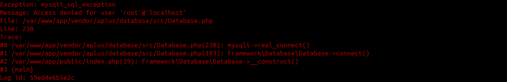

Debug
=====

Aplus Framework Debug Library.

- `Installation`_
- `Exception Handler`_
- `Debugger`_
- `Conclusion`_

Installation
------------

The installation of this library can be done with Composer:

.. code-block::

    composer require aplus/debug

Exception Handler
-----------------

The ExceptionHandler class acts by catching exceptions and shows a screen
according to the environment, production or development.

Optionally, it can receive an instance of a logger to save messages from
exceptions.

In the example below, we see a basic configuration to initialize by setting the
object as an exception handler in a production environment:

.. code-block:: php

    use Framework\Debug\ExceptionHandler;
    use Framework\Log\Loggers\SysLogger;
    
    $logger = new SysLogger();
    
    $exceptionHandler = new ExceptionHandler(
        ExceptionHandler::PRODUCTION,
        $logger
    );
    $exceptionHandler->initialize();

In the ``initialize`` method it is possible to pass a argument to also set the
object as the error handler, which is the default. If you don't want to set it
as an error handler, pass the first argument to false:

.. code-block:: php

    $exceptionHandler->initialize(false);

Production Environment
######################

When the environment is production, a simple screen will appear informing that
something went wrong and, if the logger is set, the log id will appear:

.. code-block:: php

    use Framework\Database\Database; 
    
    $database = new Database('root', 'lupalupa', logger: $logger);

.. image:: img/exception-production.png
    :alt: Aplus Debug - Exception Handler in Production

It is possible to customize this screen by setting a view file using the
``setProductionView`` method. See the original files inside the
**src/Views/exceptions** directory.

Development Environment
#######################

When the ExceptionHandler environment is set to development, a screen is shown
with much more details about the exception; the message, file location and line
number, trace, server input information, and the latest log.

.. code-block:: php

    $exceptionHandler = new ExceptionHandler(
        ExceptionHandler::DEVELOPMENT,
        $logger
    );

Example:

.. image:: img/exception-development.png
    :alt: Aplus Debug - Exception Handler in Development

The development view can also be customized. Set the file path via the
``setDevelopmentView`` method.

Command Line
############

When the exception is thrown on the command line, it will be shown as in the
example below:

Language
########

ExceptionHandler texts can be customized, using an instance of the Language
class, which can be passed by the constructor or the setter:

.. code-block:: php

    use Framework\Language\Language;

    $language = new Language('es');
    $exceptionHandler->setLanguage($language);

Example of the exception page in production with the Spanish language:

.. image:: img/exception-production-es.png
    :alt: Aplus Debug - Exception Handler in Production with Spanish language

Debugger
--------

The Framework\Debug\Debugger class has methods to help debug and, mainly, render
the debugbar.

.. code-block:: php

    <?php
    require __DIR__ . '/../vendor/autoload.php';

    use Framework\Debug\Debugger;

    $debugger = new Debugger();

    echo $debugger->renderDebugbar();

The first time the debugbar is rendered, it will be shrunk and only the icon
will appear at the bottom left of the screen:

.. image:: img/debugbar-icon.png
    :alt: Aplus Debug - Debugbar Icon

When the icon is clicked, the bar expands to the right of the screen showing the
**info** button:

.. image:: img/debugbar-wide.png
    :alt: Aplus Debug - Debugbar Wide

When **info** is clicked, the panel pops up showing basic information:

.. image:: img/debugbar-info.png
    :alt: Aplus Debug - Debugbar Info

In the code below we show how to add collections, collectors and activity data
in the debugbar:

.. code-block:: php    

    use Framework\Debug\Collector;
    use Framework\Debug\Debugger;
    
    class FooCollector extends Collector
    {
        public function getActivities() : array
        {
            $activities = [];
            foreach ($this->getData() as $index => $data) {
                $activities[] = [
                    'collector' => $this->getName(),
                    'class' => static::class,
                    'description' => 'Activity ' . ($index + 1),
                    'start' => $data['start'],
                    'end' => $data['end'],
                ];
            }
            return $activities;
        }
    
        public function getContents() : string
        {
            return '
Collector: ' . $this->getName() . '
';
        }
    }
    
    class BarCollector extends FooCollector
    {
    }
    
    $fooCollector = new FooCollector();
    
    $start = microtime(true);
    usleep(100);
    $end = microtime(true);
    $fooCollector->addData([
        'start' => $start,
        'end' => $end,
    ]);
    $start = microtime(true);
    usleep(100);
    $end = microtime(true);
    $fooCollector->addData([
        'start' => $start,
        'end' => $end,
    ]);
    
    $fooCollector2 = new FooCollector('other');
    
    $barCollector = new BarCollector();
    $start = microtime(true);
    usleep(100);
    $end = microtime(true);
    $barCollector->addData([
        'start' => $start,
        'end' => $end,
    ]);
    
    $debugger = new Debugger();
    $debugger->addCollector($fooCollector, 'Collection 1');
    $debugger->addCollector($fooCollector2, 'Collection 1');
    $debugger->addCollector($barCollector, 'Collection 2');

    echo $debugger->renderDebugbar();

Below we have images of the debugbar generated by the code above:

.. image:: img/debugbar-collection.png
    :alt: Aplus Debug - Debugbar Collection

Each collection can have multiple collectors and they will appear in a select at
the top right of the debugbar panel. Note that "other" has been selected in the
image below:

.. image:: img/debugbar-collection-other.png
    :alt: Aplus Debug - Debugbar Collection Other

When a new collection is added, it will appear in the bottom bar, to the right
of the last collection button:

.. image:: img/debugbar-collection-2.png
    :alt: Aplus Debug - Debugbar Collection 2

The activities of all collectors are compared and shown in the panel by clicking
on the **info** button, located at the bottom right of the debugbar.

.. image:: img/debugbar-activities.png
    :alt: Aplus Debug - Debugbar Activities

You can toggle the debugbar by pressing the ``Ctrl + F12`` keys.

Using the ``setDebugbarView`` method you can set a custom debug bar view for
your brand.

Conclusion
----------

Aplus Debug Library is an easy-to-use tool for, beginners and experienced, PHP developers. 
It is perfect for high-level debugging and exception handling. 
The more you use it, the more you will learn.

.. note::
    Did you find something wrong? 
    Be sure to let us know about it with an
    `issue <https://github.com/aplus-framework/debug/issues>`_. 
    Thank you!
